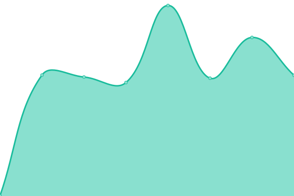
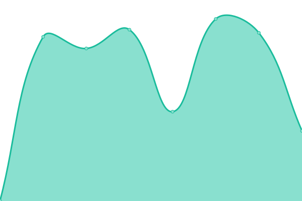
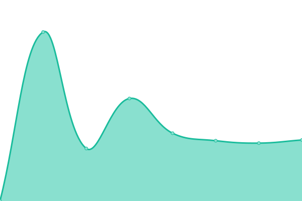
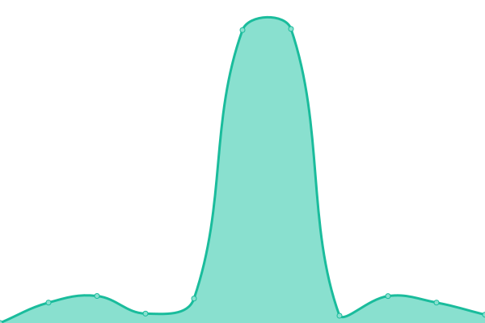

# [📈 Live Status](https://SmartTuring.github.io/upptime): <!--live status--> **Todos los sistemas están operativos**

This repository contains the open-source uptime monitor and status page for [SmartTuring](sturing.com.ec), powered by [Upptime](https://github.com/upptime/upptime).

With [Upptime](https://upptime.js.org), you can get your own unlimited and free uptime monitor and status page, powered entirely by a GitHub repository. We use [Issues](https://github.com/SmartTuring/upptime/issues) as incident reports, [Actions](https://github.com/SmartTuring/upptime/actions) as uptime monitors, and [Pages](https://SmartTuring.github.io/upptime) for the status page.

<!--start: status pages-->
<!-- This summary is generated by Upptime (https://github.com/upptime/upptime) -->
<!-- Do not edit this manually, your changes will be overwritten -->
<!-- prettier-ignore -->
| URL | Status | History | Response Time | Uptime |
| --- | ------ | ------- | ------------- | ------ |
|  [Canarios Taxi](https://app.loscanarios.ec) | Levantado | [canarios-taxi.yml](https://github.com/SmartTuring/upptime/commits/HEAD/history/canarios-taxi.yml) | 

 387ms
     
 | 

<a href="https://SmartTuring.github.io/upptime/history/canarios-taxi">100.00%</a>
    

|  [ContiYess](https://contable.contiyess.com) | Levantado | [conti-yess.yml](https://github.com/SmartTuring/upptime/commits/HEAD/history/conti-yess.yml) | 

 676ms
     
 | 

<a href="https://SmartTuring.github.io/upptime/history/conti-yess">100.00%</a>
    

|  [SmartTeam App](https://smarteamapp.fcorporation.com.ec) | Levantado | [smart-team-app.yml](https://github.com/SmartTuring/upptime/commits/HEAD/history/smart-team-app.yml) | 

 1076ms
     
 | 

<a href="https://SmartTuring.github.io/upptime/history/smart-team-app">100.00%</a>
    

|  [PGA / APPI](https://appi-ec.net) | Levantado | [pga-appi.yml](https://github.com/SmartTuring/upptime/commits/HEAD/history/pga-appi.yml) | 

 696ms
     
 | 

<a href="https://SmartTuring.github.io/upptime/history/pga-appi">100.00%</a>
    

|  Maxidelivery | Levantado | [maxidelivery.yml](https://github.com/SmartTuring/upptime/commits/HEAD/history/maxidelivery.yml) | 

 1464ms
     
 | 

<a href="https://SmartTuring.github.io/upptime/history/maxidelivery">100.00%</a>
    

<!--end: status pages-->

[**Visit our status website →**](https://SmartTuring.github.io/upptime)

## 📄 License

- Powered by: [Upptime](https://github.com/upptime/upptime)
- Code: [MIT](./LICENSE) © [SmartTuring](sturing.com.ec)
- Data in the `./history` directory: [Open Database License](https://opendatacommons.org/licenses/odbl/1-0/)
